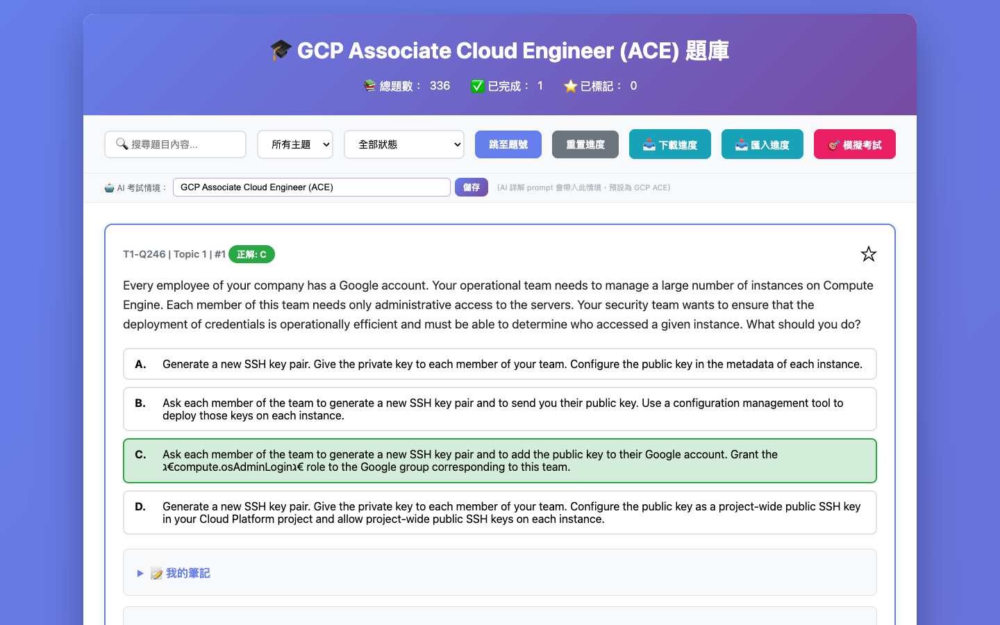
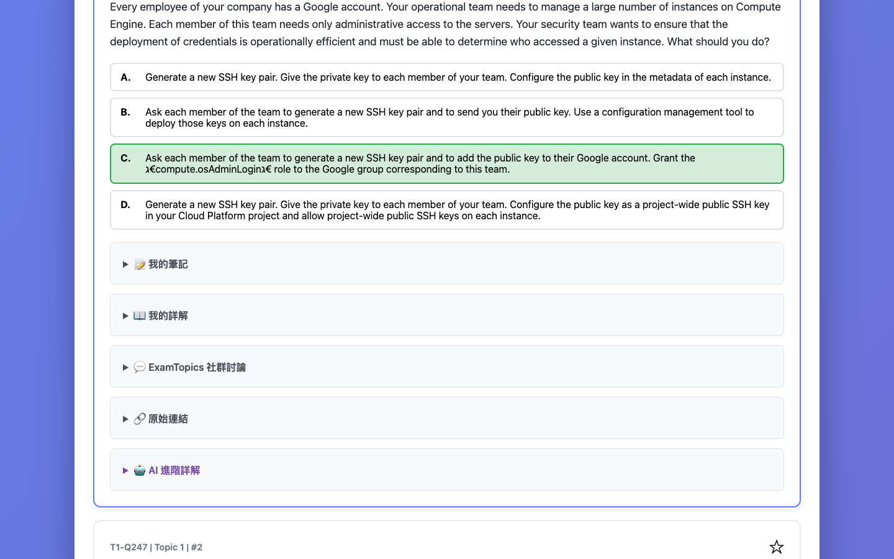
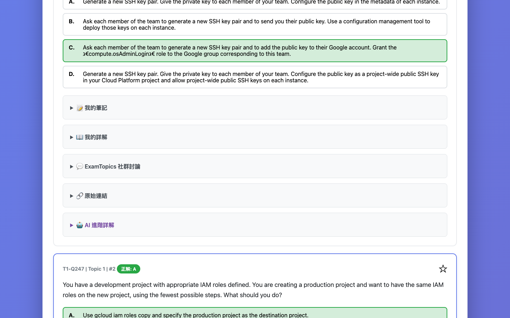
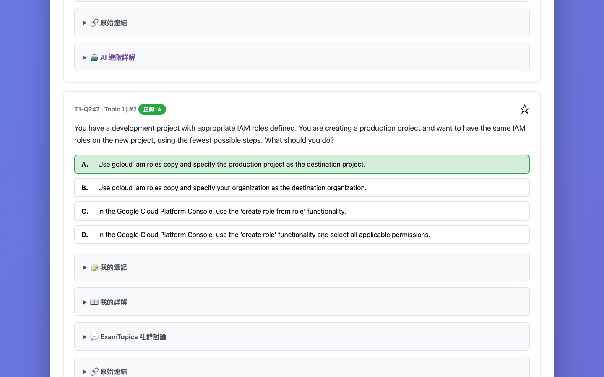
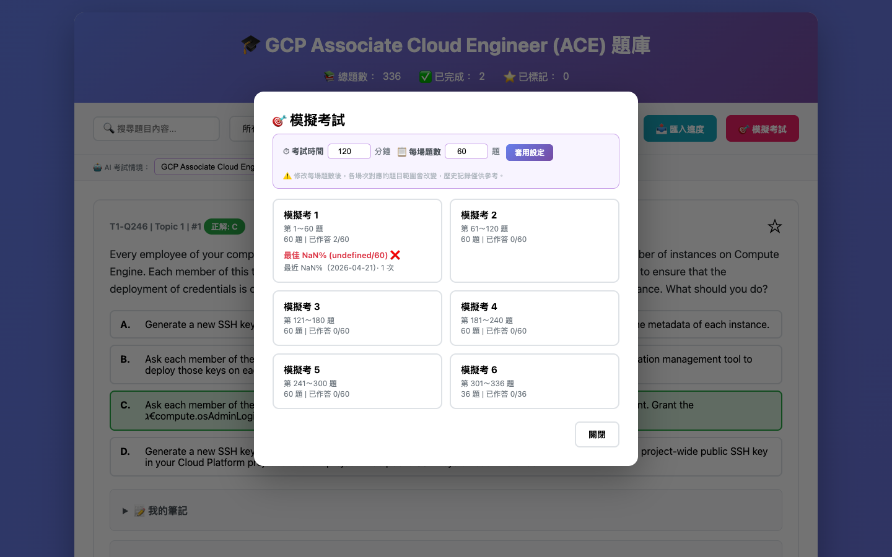

# 📚 ExamPrep — Open-Source Interactive Exam Practice System

**English** | [繁體中文](./README.md)

A pure-frontend, zero-dependency exam practice framework. Prepare your questions and explanations in JSON format and get a full interactive practice interface — progress tracking, notes, retry mode, customizable mock exam timer, and AI-powered personalized explanations.

> The framework is exam-agnostic and works with any question bank that can be organized into JSON format.

---

## 🎯 The Author's Study Story

This system was built while I was preparing for the **GCP Associate Cloud Engineer (ACE)** certification, because I couldn't find a practice tool that fit my workflow.

GCP ACE study materials are scattered across official docs, ExamTopics community discussions, and YouTube walkthroughs — but nowhere could I combine "practice + take notes + flag hard questions + mock exam + AI analysis" into one place.

So I built one.

**Here's what my actual study workflow looked like:**

1. **Practice questions** — answer each question and review the explanation
2. **Flag hard ones** — hit ⭐ bookmark on tricky IAM or VPC questions
3. **Take notes** — record "why C, not B" reasoning under each question
4. **AI explanation** — after a wrong answer, ask AI to break down the mistake, or ask follow-up questions like "how would this Service Account pattern work in production?"
5. **Mock exam** — set 60 questions / 2 hours to simulate real exam pressure
6. **Retry mode** — the night before, drill only bookmarked and wrong questions

This framework automates all of the above. Just swap in your own question bank JSON and you're ready to use the same system for any exam.

---

## 📸 Screenshots

### Question Practice Interface — Progress Stats, Answer Options, Answer Reveal
Each question can be expanded to view options. After answering, the correct answer, explanation, community discussion, notes panel, and AI explanation entry are shown. The top stats bar shows live completion count and bookmark count.


### Explanation Panel — Correct Answer Analysis + Notes


### AI Advanced Explanation — Error Analysis


### AI Multi-turn Conversation — Keep Asking
AI explanations support **multi-turn conversation** — not just a one-shot analysis. You can follow up on any detail, and the conversation history is saved automatically so you can pick up right where you left off next time you open the same question.


### Mock Exam — Session Picker + Timer


---

## ⚠️ Prerequisites

Before you start, understand these two things:

### 1. You need to write your own explanations

The explanations in `explanations.json` **must be prepared by you**.

This framework does not generate explanation content — it only displays the explanations you provide in a clean, interactive interface.

**Recommended approach:**
- Manually analyze each correct answer and why wrong options are wrong
- Use ChatGPT / Claude to generate a draft in bulk, then review and edit
- Use the included `explanations.json` format as a reference template

See the "Replacing with your own question bank" section below for the format.

---

### 2. AI explanations require your own AI API

The "🤖 AI Advanced Explanation" feature calls an **OpenAI-compatible API** (default: `localhost:4142`).

**You need one of:**
- A local LLM proxy (e.g., [LM Studio](https://lmstudio.ai/), [Ollama](https://ollama.ai/), [OpenCode](https://opencode.ai))
- Or update `AI_ENDPOINT` / `AI_KEY` / `AI_MODEL` in `index.html` to a cloud API (OpenAI, Anthropic, Google, etc.)

```javascript
// AI settings in index.html (edit as needed)
const AI_ENDPOINT = 'http://localhost:4142/v1/chat/completions';
const AI_MODEL    = 'gemini-3-flash-preview';
const AI_KEY      = 'your-api-key-here';
```

> ℹ️ All other features work fine without an AI API — practice mode, mock exams, notes, retry mode. AI explanations are an optional add-on.

---

## ✨ Features

| Feature | Description |
|---------|-------------|
| 📖 **Interactive Practice** | Answer questions, reveal explanations, auto-save progress |
| ⭐ **Bookmarks** | Flag important or tricky questions |
| 📝 **Per-question Notes** | Record your reasoning, included in progress backups |
| 🔄 **Retry Mode** | Filter bookmarked/wrong questions, hide answers for re-drilling |
| 🎯 **Mock Exam** | Customize questions per session and time limit, auto-split sessions with timer |
| 🤖 **AI Explanation** | Error analysis + multi-turn free Q&A (requires your own AI API) |
| 💬 **Community Discussion** | Formatted display of ExamTopics raw discussion threads |
| 💾 **Progress Management** | Auto-save to localStorage; export/import single JSON (answers, notes, AI cache, exam history) |
| 🔍 **Search & Filter** | Filter by content, topic, or completion status |

---

## 🚀 Quick Start

### Option A: Embedded Version (Recommended — zero setup)

Just **double-click** `index-embedded.html`. No server needed, no installation.

### Option B: Server Mode (for dynamic JSON updates)

```bash
# macOS / Linux
python3 -m http.server 8000

# Windows
python -m http.server 8000
```

Open `http://localhost:8000` in your browser.

---

## 📁 File Structure

```
.
├── index.html              # Main source (edit this for development)
├── index-embedded.html     # Standalone version (ready to use)
├── questions.json          # Question bank data
├── explanations.json       # Explanations (you write these)
├── generate_embedded.py    # Regenerate the embedded version
├── parse.py                # Example data parsing script
├── start-server.command    # macOS one-click server launcher
├── start-server.bat        # Windows one-click server launcher
└── README.md
```

---

## 🔧 Replacing with Your Own Question Bank

This framework works with **any exam** — just replace the two JSON files.

### `questions.json` Format

```json
[
  {
    "id": "T1-Q1",
    "topic": 1,
    "idx": 1,
    "question": "Question text here",
    "options": {
      "A": "Option A text",
      "B": "Option B text",
      "C": "Option C text",
      "D": "Option D text"
    },
    "answer": "A",
    "comments_raw": "[username1] Selected Answer: A reason... [username2] Selected Answer: B another view...",
    "link": "https://example.com/question/1",
    "timestamp": "2024-01"
  }
]
```

| Field | Required | Description |
|-------|----------|-------------|
| `id` | ✅ | Unique identifier, suggest `TopicX-QY` format |
| `topic` | ✅ | Topic number (integer); rendered as "Topic N" in the UI, used for filtering |
| `idx` | ✅ | Display index (integer); shown in the top-right corner of each question |
| `question` | ✅ | Question text |
| `options` | ✅ | Options object (A/B/C/D, fewer or more supported) |
| `answer` | ✅ | Correct answer; for multi-select use comma-separated like `"A,C"` |
| `comments_raw` | — | Raw community discussion text; auto-parsed using `[username]` format; can be empty string |
| `link` | — | Source URL |
| `timestamp` | — | Question date stamp |

### `explanations.json` Format

```json
{
  "T1-Q1": {
    "correct": "Detailed explanation of the correct answer (recommended)",
    "wrong": {
      "B": "Why B is incorrect",
      "C": "Why C is incorrect",
      "D": "Why D is incorrect"
    },
    "knowledge": ["keyword1", "keyword2"],
    "best_practice": "Related best practice guidance",
    "gcloud": "gcloud example command",
    "docs": "https://official-docs-link"
  }
}
```

- Keys map to `id` values in `questions.json`
- Only `correct` is strongly recommended; all other fields are optional
- Questions without a matching explanation still display normally — the explanation panel is simply skipped

> 💡 **Recommended workflow**: Feed your questions and answers to ChatGPT/Claude to generate a draft `explanations.json` in bulk, then review and refine manually.

### Regenerating the Embedded Version

After modifying any JSON or `index.html`, run:

```bash
python3 generate_embedded.py
```

---

## 🤖 AI Explanation Setup

### Edit API Settings

Open `index.html` and find these three lines:

```javascript
const AI_ENDPOINT = 'http://localhost:4142/v1/chat/completions';  // API endpoint
const AI_MODEL    = 'gemini-3-flash-preview';                      // Model name
const AI_KEY      = 'your-api-key-here';                           // API key
```

After editing, run `python3 generate_embedded.py` to regenerate.

### Compatible Services

| Service | Notes |
|---------|-------|
| [LM Studio](https://lmstudio.ai/) | Run open-source models locally, default `localhost:1234` |
| [Ollama](https://ollama.ai/) | Lightweight local models, default `localhost:11434` |
| [OpenAI API](https://platform.openai.com/) | Cloud GPT models, update endpoint and key |
| [OpenCode](https://opencode.ai) | Developer tool, local proxy `localhost:4142` |

### Custom Exam Context

The control bar has an **🤖 AI Exam Context** field, defaulting to `GCP Associate Cloud Engineer (ACE)`. Update this when using a different question bank — the AI prompt will automatically use it. Saved to `localStorage`.

---

## 🎯 Mock Exam

Click "🎯 模擬考試" to enter exam mode. You can customize:
- **Time limit** (minutes, default 120)
- **Questions per session** (default 60)

The system auto-splits all questions into sessions. Click a session card to start. The timer auto-submits when time runs out, and shows per-topic accuracy analysis and exam history.

---

## 📝 Notes & Retry Mode

**Notes**: Expand "📝 我的筆記" under any question. Auto-saves 500ms after you stop typing. Included in progress JSON exports. The intended use is to capture your **in-the-moment reasoning** — e.g. "why C over B" or "not sure about this concept, revisit later" — so when you come back to retry, the note tells you exactly why you bookmarked it in the first place.

**Retry Mode** (status filter):
- **⭐ Bookmarked (Retry)**: Shows bookmarked questions with answers hidden
- **❌ Wrong (Retry)**: Shows incorrectly answered questions with answers hidden

Revealing an answer in retry mode only applies to the current session — **it does not overwrite saved progress**.

---

## 💾 Progress Management

- **📥 Download Progress**: Export everything as JSON (answers, bookmarks, notes, AI cache, exam history)
- **📤 Import Progress**: Restore from a backup JSON (full overwrite)

> ⚠️ Clearing browser cache will delete your progress. Export backups regularly.

---

## 🌐 Requirements

| Feature | Requirement |
|---------|-------------|
| Embedded version | Any modern browser, no dependencies |
| Server mode | Python 3.6+ |
| AI explanations | Local or cloud OpenAI-compatible API |
| Regenerate embedded | Python 3.6+ |

---

## ⚙️ Troubleshooting

**"Cannot load question data"**: Use `index-embedded.html` to avoid this entirely. In server mode, confirm JSON files are in the same directory.

**Progress lost**: Use a regular (non-incognito) browser window and export backups regularly.

**AI explanation fails**: Check that your API endpoint is correct and the service is running.

---

## 📜 About the Default Question Bank

The default GCP ACE question bank is sourced from [ExamTopics](https://www.examtopics.com/) community discussions. Explanations were generated with AI assistance and reviewed manually. To replace with your own bank, see the section above.

---

## 🤖 Customize with an AI Agent

Paste this prompt into any AI Agent (Claude, ChatGPT, Cursor, etc.) to convert your question source or generate explanations automatically:

```
Please refer to this project's structure and JSON formats (questions.json / explanations.json),
then convert the following question data into compatible format and generate the corresponding explanations.
[paste your question source here]
```

---

## 📅 Version History

**Version: 2.8** | Last Updated: 2026-04-23

| Version | Date | Changes |
|---------|------|---------|
| 2.8 | 2026-04-23 | Restore text labels to action buttons (Reset/Export/Import) while maintaining compact layout |
| 2.7 | 2026-04-23 | Optimize top controls layout: reduce gaps and padding to fit everything on one line |
| 2.6 | 2026-04-23 | Fix exam mode selected-option highlight; jump-to-question now uses # idx with number input; pagination adds manual page input |
| 2.5 | 2026-04-23 | Fix: imported AI chat history now displays correctly; import now re-applies active filters |
| 2.4 | 2026-04-23 | Exam mode: selecting an option shows no visual feedback; explanation/discussion/AI panels hidden; only notes visible |
| 2.3 | 2026-04-23 | AI free Q&A upgraded to multi-turn chat (bubble UI, chat history save/restore, clear conversation) |
| 2.2 | 2026-04-23 | Exam session cards show real best score + attempt count + last date; progress export merged into single JSON (includes AI cache, exam history) |
| 2.1 | 2026-04-22 | AI two-button layout, custom AI exam context, custom exam time/question count, formatted community discussion, bilingual README |
| 2.0 | 2026-04-22 | Notes panel, retry mode, AI explanations, mock exam (6 sessions) |
| 1.1 | 2026-04-22 | Expanded question bank, fixed HTML injection bug |
| 1.0 | 2026-04-21 | Initial release |
