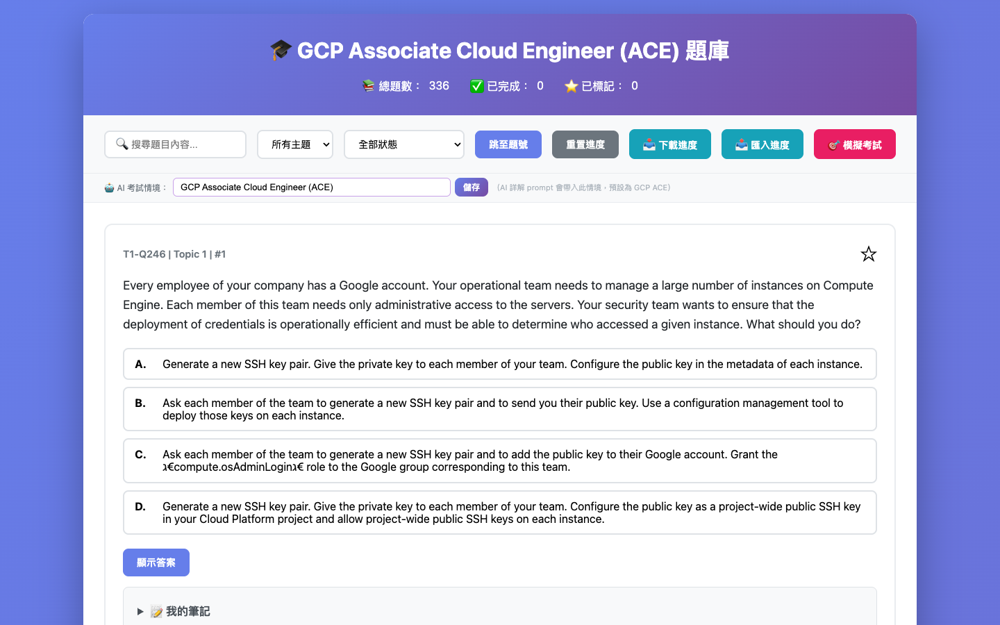

# 📚 ExamPrep — 開源互動式題庫練習系統

[English](./README.en.md) | **繁體中文**

一個純前端、零依賴的題庫練習框架。準備好 JSON 格式的題目與詳解，就能擁有完整的互動練習介面——進度追蹤、筆記、重考模式、自訂模擬考試計時器與 AI 個人化詳解。

> 框架本身不限考試種類，適用於任何可整理成 JSON 格式的題庫。

---

## 🎯 作者的備考故事

這套系統是我備考 **GCP Associate Cloud Engineer（ACE）** 認證時，因為找不到順手的刷題工具而自己動手做的。

GCP ACE 的備考材料散落各處——官方文件、ExamTopics 社群討論、YouTube 解說影片——但沒有一個地方可以讓我「刷題 + 做筆記 + 標記難題 + 模擬考試 + AI 個人化分析」全部整合在一起。

所以我就做了一個。

**實際的備考流程長這樣：**

1. **刷題練習**：逐題作答，翻開詳解確認觀念
2. **標記難題**：遇到搞不清楚的 IAM 或 VPC 題目，按 ⭐ 書籤
3. **做筆記**：在每題下方記下「為什麼選 C 不選 B」這種思考
4. **AI 詳解**：答錯之後請 AI 解釋錯誤原因，或自由提問「這個 Service Account 的情境實際上怎麼用？」
5. **模擬考試**：設定 60 題 / 2 小時，模擬真實考試壓力
6. **重考模式**：考前一天只刷「標記題」與「答錯題」

這套框架把以上流程全部自動化了。你只需要換上自己的題庫 JSON，就能用同樣的系統備考任何考試。

---

## 📸 功能截圖

### 主題庫介面 — 含進度統計


### 展開題目 — 選項 + 答案揭曉


### 詳解區 — 正確答案分析 + 筆記


### AI 進階詳解 — 錯誤分析


### AI 多輪對話 — 自由提問


### 模擬考試 — 場次選擇 + 計時


---

## ⚠️ 使用前提

在開始之前，請確認你了解以下兩點：

### 1. 詳解需要自己撰寫

`explanations.json` 中的每題詳解**需要你自己準備**。

這套框架不會幫你生成詳解內容——它只負責把你準備好的詳解漂亮地呈現出來。

**建議做法：**
- 手動整理每題的正解分析與錯誤選項原因
- 利用 ChatGPT / Claude 等工具批量生成初稿，再人工校對
- 參考本 repo 的 `explanations.json` 格式作為範本

詳解格式說明見下方「替換成自己的題庫」章節。

---

### 2. AI 進階詳解需要自己的 AI API

「🤖 AI 進階詳解」功能會呼叫 **OpenAI 相容 API**（預設 `localhost:4142`）。

**你需要：**
- 一個本地 LLM proxy 服務（例如：[LM Studio](https://lmstudio.ai/)、[Ollama](https://ollama.ai/)、[OpenCode](https://opencode.ai) 等）
- 或自行修改 `index.html` 中的 `AI_ENDPOINT` / `AI_KEY` / `AI_MODEL` 改為雲端 API（OpenAI、Anthropic、Google 等）

```javascript
// index.html 中的 AI 設定（可自行修改）
const AI_ENDPOINT = 'http://localhost:4142/v1/chat/completions';
const AI_MODEL    = 'gemini-3-flash-preview';
const AI_KEY      = 'your-api-key-here';
```

> ℹ️ 不設定 AI API 也完全沒關係，其他所有功能（練習、模擬考、筆記、重考等）均可正常使用，AI 詳解只是附加功能。

---

## ✨ 功能一覽

| 功能 | 說明 |
|------|------|
| 📖 **互動練習** | 選答案、顯示詳解、自動儲存進度 |
| ⭐ **書籤 / 標記** | 標記重要或易錯題目 |
| 📝 **每題筆記** | 記錄答題思路，包含於進度備份 |
| 🔄 **重考模式** | 篩選標記 / 答錯題目，隱藏答案重新作答 |
| 🎯 **模擬考試** | 自訂每場題數與考試時間，自動切分場次，計時計分 |
| 🤖 **AI 進階詳解** | 錯誤分析 + 多輪自由提問對話（需自備 AI API） |
| 💬 **社群討論** | 格式化顯示 ExamTopics 原始討論 |
| 💾 **進度管理** | localStorage 自動儲存，單一 JSON 匯出／匯入（含答題、筆記、AI 快取、考試歷史） |
| 🔍 **搜尋 / 篩選** | 依內容、主題、完成狀態篩選 |

---

## 🚀 快速開始

### 方案 A：嵌入式版本（推薦，零設定）

直接**雙擊** `index-embedded.html`，無需伺服器、無需安裝任何東西。

### 方案 B：伺服器模式（可動態更新 JSON）

```bash
# macOS / Linux
python3 -m http.server 8000

# Windows
python -m http.server 8000
```

瀏覽器開啟 `http://localhost:8000`

---

## 📁 檔案結構

```
.
├── index.html              # 主程式（開發修改這裡）
├── index-embedded.html     # 嵌入式版本（直接使用）
├── questions.json          # 題庫資料
├── explanations.json       # 題目詳解（需自行撰寫）
├── generate_embedded.py    # 重新生成嵌入式版本
├── parse.py                # 原始資料解析腳本（範例）
├── start-server.command    # macOS 一鍵啟動伺服器
├── start-server.bat        # Windows 一鍵啟動伺服器
└── README.md
```

---

## 🔧 替換成自己的題庫

這套框架可以拿來練習**任何考試**，只需要替換兩個 JSON 檔案。

### `questions.json` 格式

```json
[
  {
    "id": "T1-Q1",
    "topic": "Topic 1",
    "question": "題目內容",
    "options": {
      "A": "選項 A 內容",
      "B": "選項 B 內容",
      "C": "選項 C 內容",
      "D": "選項 D 內容"
    },
    "answer": "A",
    "comments_raw": "[username1] Selected Answer: A 理由說明... [username2] Selected Answer: B 另一種看法...",
    "link": "https://example.com/question/1",
    "timestamp": "2024-01"
  }
]
```

| 欄位 | 必填 | 說明 |
|------|------|------|
| `id` | ✅ | 唯一識別碼，建議 `TopicX-QY` 格式 |
| `topic` | ✅ | 主題分類，用於篩選器 |
| `question` | ✅ | 題目內容 |
| `options` | ✅ | 選項物件（A/B/C/D，可多於或少於四個） |
| `answer` | ✅ | 正確答案；多選題用逗號分隔，如 `"A,C"` |
| `comments_raw` | — | 社群討論原始文字，系統自動解析 `[username]` 格式；可留空字串 |
| `link` | — | 題目來源連結 |
| `timestamp` | — | 題目時間戳記 |

### `explanations.json` 格式

```json
{
  "T1-Q1": {
    "correct": "正確答案的詳細說明（建議填寫）",
    "wrong": {
      "B": "B 選項錯誤的原因",
      "C": "C 選項錯誤的原因",
      "D": "D 選項錯誤的原因"
    },
    "knowledge": ["關鍵字1", "關鍵字2"],
    "best_practice": "相關最佳實踐建議",
    "gcloud_commands": ["gcloud example command"],
    "links": ["https://官方文件連結"]
  }
}
```

- key 對應 `questions.json` 的 `id`
- 只有 `correct` 是建議填寫的，其他欄位皆選填
- 沒有對應詳解的題目仍可正常顯示，僅略過詳解區塊

> 💡 **建議做法**：用 ChatGPT / Claude 批量生成 `explanations.json` 初稿（餵入題目與正解），再人工審核調整，效率最高。

### 更新嵌入式版本

修改 JSON 後，執行以下指令重新生成 `index-embedded.html`：

```bash
python3 generate_embedded.py
```

---

## 🤖 AI 進階詳解設定

### 修改 API 設定

開啟 `index.html`，找到以下三行並修改：

```javascript
const AI_ENDPOINT = 'http://localhost:4142/v1/chat/completions';  // API 端點
const AI_MODEL    = 'gemini-3-flash-preview';                      // 模型名稱
const AI_KEY      = 'your-api-key-here';                           // API 金鑰
```

修改後執行 `python3 generate_embedded.py` 重新生成嵌入式版本。

### 常見相容服務

| 服務 | 說明 |
|------|------|
| [LM Studio](https://lmstudio.ai/) | 本地運行開源模型，預設 `localhost:1234` |
| [Ollama](https://ollama.ai/) | 輕量本地模型，預設 `localhost:11434` |
| [OpenAI API](https://platform.openai.com/) | 雲端 GPT 系列，需替換 endpoint 與 key |
| [OpenCode](https://opencode.ai) | 開發者工具，本地 proxy `localhost:4142` |

### 自訂考試情境

介面控制列有「**🤖 AI 考試情境**」欄位，預設為 `GCP Associate Cloud Engineer (ACE)`。換成自己的題庫時修改此欄位，AI prompt 即自動帶入對應情境。設定存於 `localStorage`。

---

## 🎯 模擬考試

點「🎯 模擬考試」後，可自訂：
- **考試時間**（分鐘，預設 120）
- **每場題數**（題，預設 60）

套用後系統自動切分場次，點場次卡片即可開考。計時結束自動交卷，顯示各主題正確率分析與歷史記錄。

---

## 📝 筆記 & 重考模式

**筆記**：每題展開「📝 我的筆記」，輸入後 500ms 自動儲存，包含於進度 JSON 備份。

**重考模式**（狀態篩選器）：
- **⭐ 已標記（重考）**：顯示書籤題，隱藏答案
- **❌ 答錯（重考）**：顯示答錯題，隱藏答案

點「顯示答案」只在當次 session 揭曉，**不修改已儲存進度**。

---

## 💾 進度管理

- **📥 下載進度**：匯出為 JSON（含所有答題、書籤、筆記、AI 快取、考試歷史）
- **📤 匯入進度**：選擇備份 JSON 恢復（完整覆蓋）

> ⚠️ 清除瀏覽器快取會導致進度遺失，建議定期匯出備份。

---

## 🌐 環境需求

| 功能 | 需求 |
|------|------|
| 嵌入式版本 | 任何現代瀏覽器，無其他依賴 |
| 伺服器模式 | Python 3.6+ |
| AI 詳解 | 本地或雲端 OpenAI 相容 API |
| 重新生成嵌入式 | Python 3.6+ |

---

## ⚙️ 故障排除

**「無法載入題庫資料」**：使用 `index-embedded.html` 即可避免；伺服器模式請確認 JSON 檔案在同一目錄。

**進度遺失**：請使用一般瀏覽器視窗（非無痕），並定期匯出備份。

**AI 詳解失敗**：確認 API endpoint 是否正確且服務在線。

---

## 📜 關於預設題庫

預設搭載的 GCP ACE 題庫來自 [ExamTopics](https://www.examtopics.com/) 社群討論，詳解由 AI 輔助整理並人工校對。如需替換，請參考上方「替換成自己的題庫」章節。

---

## 📅 版本資訊

**版本：2.3** | 最後更新：2026-04-23

| 版本 | 日期 | 內容 |
|------|------|------|
| 2.3 | 2026-04-23 | AI 自由提問升級為多輪對話（氣泡介面、對話歷史儲存與還原、清除對話） |
| 2.2 | 2026-04-23 | 模擬考試場次卡片顯示真實最佳分數＋嘗試次數＋最近日期；進度匯出合併為單一 JSON（含 AI 快取、考試歷史） |
| 2.1 | 2026-04-22 | AI 兩按鈕、AI 考試情境自訂、模擬考試時間 / 題數自訂、社群討論格式化、README 雙語 |
| 2.0 | 2026-04-22 | 筆記欄、重考模式、AI 進階詳解、模擬考試（6 場次）|
| 1.1 | 2026-04-22 | 新增 51 題（總計 363 題），修復 HTML 注入 bug |
| 1.0 | 2026-04-21 | 初始版本，285 題完整題庫 |
